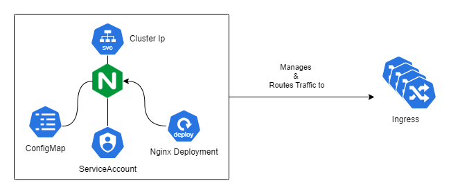

# Ingress
[⬅️ Back to Kubernetes overview](README.md)


## Setup ingress controller


_This overview shows a nginx ingress controller, containing a self-managed nginx deployment. The controller manages ingress resources from e.g. your service._

> Official installation guide for help: https://kubernetes.github.io/ingress-nginx/deploy/#docker-desktop

### Configure Cluster when using kind:
_Unfortunately, the only point in time during which we can set static port mappings to a kind cluster is during its creation. Because of that, we need to recreate the cluster here, and add the required attributes._

From Kind [Documentation](https://kind.sigs.k8s.io/docs/user/ingress/)
1. Setup Cluster

```sh
kind delete cluster #if one is alrady created
cat <<EOF | kind create cluster --config=-
kind: Cluster
apiVersion: kind.x-k8s.io/v1alpha4
nodes:
- role: control-plane
  kubeadmConfigPatches:
  - |
    kind: InitConfiguration
    nodeRegistration:
      kubeletExtraArgs:
        node-labels: "ingress-ready=true"
  extraPortMappings:
  - containerPort: 80
    hostPort: 80
    protocol: TCP
  - containerPort: 443
    hostPort: 443
    protocol: TCP
EOF
```
> [!WARNING]
> you may need to change the hostport when some other service is already using it


2. Deploy Ingress Controller. [Github link](https://github.com/kubernetes/ingress-nginx)
```sh
kubectl apply -f https://raw.githubusercontent.com/kubernetes/ingress-nginx/main/deploy/static/provider/kind/deploy.yaml
# or with docker desktop kubernetes
kubectl apply -f https://raw.githubusercontent.com/kubernetes/ingress-nginx/main/deploy/static/provider/cloud/deploy.yaml
```


### When using Minikube
From the setup guide in the [Documentation](https://kubernetes.io/docs/tasks/access-application-cluster/ingress-minikube/) 

```sh
minikube addons enable ingress
minikube service -n ingress-nginx ingress-nginx-controller
```


## Start port forwarding to ingress controller 
> [!WARNING]
> This needs to stay running for the following steps to function
```sh
kubectl port-forward --namespace=ingress-nginx service/ingress-nginx-controller 8080:80
```


## Setup applications 

1. Deploy a hello world app:
```sh
kubectl create deployment web --image=gcr.io/google-samples/hello-app:1.0
kubectl expose deployment web --type=NodePort --port=8080 # the expose command creates a service of type node port for the web deployment
```

## Create an Ingress 
```yaml
apiVersion: networking.k8s.io/v1
kind: Ingress
metadata:
  name: demo-ingress
spec:
  ingressClassName: nginx
  rules:
  - host: demo.cloud
    http:
        paths:
          - path: /
            pathType: Prefix
            backend:
              service:
                name: web
                port:
                  number: 8080
```
Run `kubectl apply -f ingress.yaml` to create it.

To test
on kind:
```sh
# with minikube replace 127.0.0.1 with $(minikube ip)
curl --resolve demo.cloud:8080:127.0.0.1 http://demo.cloud:8080
```

## Create another deployment

```sh
kubectl create deployment web2 --image=gcr.io/google-samples/hello-app:2.0
kubectl expose deployment web2 --port=8080 --type=NodePort
```

Now we extend the ingress we created before by creating a route for our second service:

```yaml
- path: /v2
  pathType: Prefix
  backend:
    service:
      name: web2
      port:
        number: 8080
```

Run `kubectl apply -f ingress.yaml` to update it.

## Test the ingresses
```sh
curl --resolve demo.cloud:8080:127.0.0.1 http://demo.cloud:8080
## Output should be similar to:
# Hello, world!
# Version: 1.0.0
# Hostname: web-55b8c6998d-8k56

curl --resolve demo.cloud:8080:127.0.0.1 http://demo.cloud:8080/v2
## Output should be similar to:
# Hello, world!
# Version: 2.0.0
# Hostname: web-55b8c6998d-8k56


```

## Further Reading


- https://devopscube.com/kubernetes-ingress-tutorial/ 
- https://kubernetes.io/docs/concepts/services-networking/ingress/ 
- https://kubernetes.io/docs/tasks/access-application-cluster/ingress-minikube/
