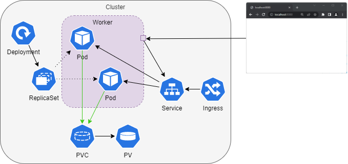

# Putting everything together 

## Tasks

- Create a Deployment of an Apache webserver consisting of two Pods.
- Add a Liveness probe for the Apache webserver deployment. See the [example](presentation-demo/probes/probe_liveness.yaml)from the presentation demo.
- Optional: deploy your app in a dedicated Namespace (not in the default Namespace).

💡  On OpenShift, use `ubi8/httpd-24` instead of `httpd` because of security constraints (users and ports).

---

### Store the website on a PersistentVolume

Store the website on a PersistentVolume shared by the Pods of the Deployment. The Apache webserver serves content from `/usr/local/apache2/htdocs/`.

💡 `kubectl cp` can be used to copy files to containers.

💡 Use `kubectl cp -h` for help & examples on how to use it.

### Route

*If you're operating on an OpenShift Cluster, you should add routes instead of ingress resources.*

- Create a ClusterIP Service for the apache webserver deployment
- Create an edge-terminated route exposing the service, see [OpenShift Routes](https://docs.openshift.com/container-platform/4.16/networking/routes/route-configuration.html#nw-creating-a-route_route-configuration) for the official documentation.

💡 If you don't provide a hostname to the route, it will be autogenerated based on project and app name.

#### Ingress

*If you're operating on an OpenShift Cluster, you should add routes instead of ingress resources.*

- Create a ClusterIP Service for the apache webserver deployment
- Create an ingress pointing to the service. Consult the [ingress guide](./kubernetes-ingress.md) for help.

