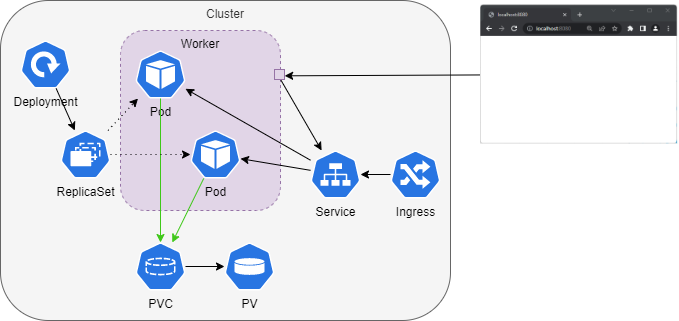

# Putting everything together 

### Tasks

- Create a Deployment of an Apache webserver consisting of two Pods.
- Expose the website with a Service of the type NodePort
- Deploy your app in a dedicated Namespace (not in the default Namespace).

---

#### Optional: Configure a Liveness probe

Add a Liveness probe for the Apache webserver deployment. See the [example](presentation-demo/probes/probe_liveness.yaml)
from the presentation demo.

#### Optional: Store the website on a PersistentVolume

Store the website on a PersistentVolume shared by the Pods of the Deployment. The Apache webserver serves content from `/usr/local/apache2/htdocs/`.

💡 `kubectl cp` cna be used to copy files to containers.

💡 Use `kubectl cp -h` for help & examples on how to use it.

#### Optional: Ingress

You can use of the following [ingress controllers](https://kubernetes.io/docs/concepts/services-networking/ingress-controllers/).
We suggest to use the [ingress-nginx](https://github.com/kubernetes/ingress-nginx/blob/main/README.md#readme) controller. 

You can deploy it via Helm see https://artifacthub.io/packages/helm/ingress-nginx/ingress-nginx.

💡 Set the http port for nginx to 8088 `--set controller.service.ports.http=8088`
